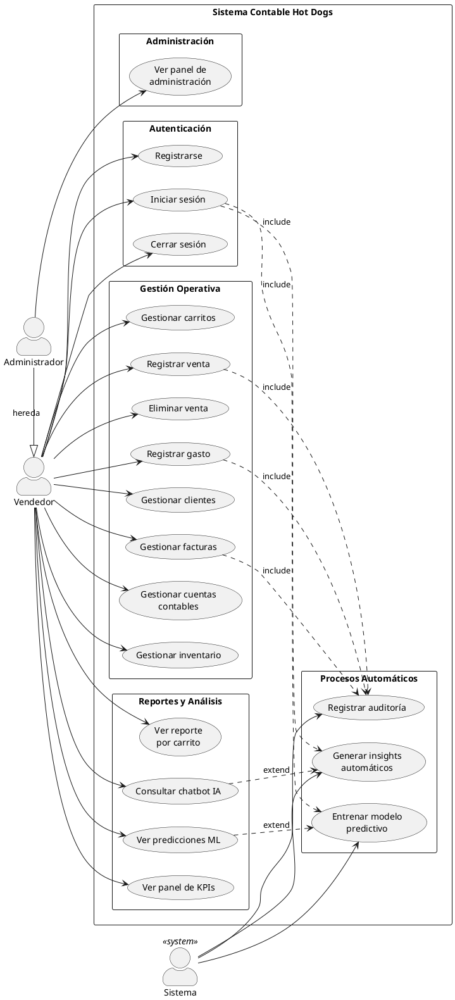
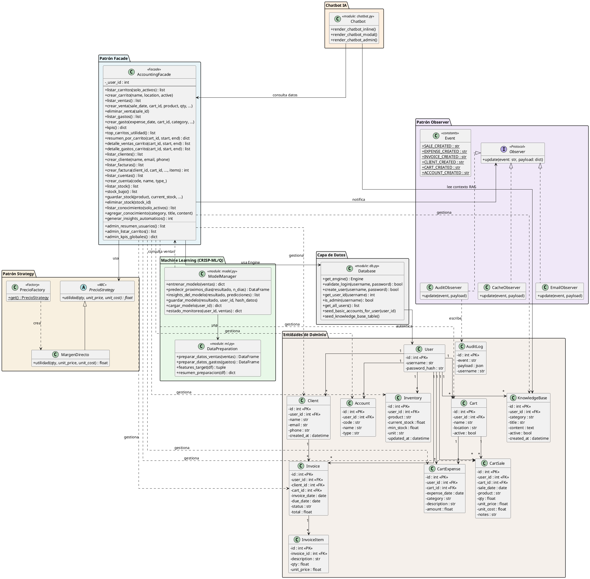

# Diagramas UML — Sistema Contable Hot Dogs

> **Cómo usar:** Copia el código entre `@startuml` y `@enduml` y pégalo en
> [plantuml.com/plantuml](https://www.plantuml.com/plantuml/uml),
> la extensión **PlantUML** de VS Code, o cualquier herramienta compatible.

---

## 1. Diagrama de Casos de Uso

### 1.1 Descripción textual

| # | Caso de uso | Actor(es) | Descripción |
|---|------------|-----------|-------------|
| CU-01 | Registrarse | Vendedor | El usuario crea una cuenta nueva con usuario y contraseña. |
| CU-02 | Iniciar sesión | Vendedor, Administrador | El usuario ingresa sus credenciales para acceder al sistema. |
| CU-03 | Cerrar sesión | Vendedor, Administrador | El usuario finaliza su sesión activa. |
| CU-04 | Gestionar carritos | Vendedor | Crear, activar/desactivar y consultar puntos de venta (carritos). |
| CU-05 | Registrar venta | Vendedor | Registrar la venta de productos con fecha, carrito, cantidad, precio y costo. |
| CU-06 | Eliminar venta | Vendedor | Eliminar un registro de venta existente. |
| CU-07 | Registrar gasto | Vendedor | Registrar un gasto operativo asociado a un carrito. |
| CU-08 | Ver panel de KPIs | Vendedor | Consultar resumen financiero: ingresos, costos, gastos, utilidad. |
| CU-09 | Ver reporte por carrito | Vendedor | Consultar análisis financiero detallado de un carrito en un rango de fechas. |
| CU-10 | Gestionar clientes | Vendedor | Crear y consultar el directorio de clientes. |
| CU-11 | Gestionar facturas | Vendedor | Crear facturas asociadas a clientes con ítems detallados. |
| CU-12 | Gestionar cuentas contables | Vendedor | Crear y consultar el catálogo de cuentas contables. |
| CU-13 | Gestionar inventario | Vendedor | Registrar productos, stock actual, stock mínimo y eliminar registros. |
| CU-14 | Consultar chatbot IA | Vendedor | Hacer preguntas al asistente IA que responde con datos financieros reales. |
| CU-15 | Ver predicciones ML | Vendedor | Consultar predicciones de ventas generadas por el modelo predictivo (CRISP-ML). |
| CU-16 | Ver panel de administración | Administrador | Ver KPIs globales, resumen de todos los usuarios y carritos de toda la plataforma. |
| CU-17 | Entrenar modelo predictivo | Sistema | El sistema entrena/recarga automáticamente el modelo ML al iniciar sesión si detecta datos nuevos. |
| CU-18 | Generar insights automáticos | Sistema | El sistema analiza ventas, gastos y tendencias para crear conocimiento para el chatbot. |
| CU-19 | Registrar auditoría | Sistema | El sistema registra cada evento (venta, gasto, factura, etc.) en la tabla audit_log vía el Observer. |

### 1.2 Código PlantUML

---

## 2. Diagrama de Clases

### 2.1 Descripción textual

| Clase / Módulo | Tipo | Responsabilidad |
|---|---|---|
| `AccountingFacade` | Clase (Patrón Facade) | Punto de entrada único para todas las operaciones del dominio. Filtra por `user_id` (multitenant). Métodos: CRUD de carritos, ventas, gastos, clientes, facturas, cuentas, inventario, KPIs, chatbot knowledge base, insights automáticos. Métodos admin sin filtro de usuario. |
| `Observer` | Protocolo (interfaz) | Define el contrato `update(event, payload)` para observadores. |
| `AuditObserver` | Clase | Implementa Observer. Inserta cada evento en la tabla `audit_log`. |
| `CacheObserver` | Clase | Implementa Observer. Limpia caches de Streamlit tras cada cambio. |
| `EmailObserver` | Clase | Implementa Observer. Envía correo SMTP opcional al ocurrir un evento. |
| `Event` | Clase (constantes) | Define los nombres de eventos soportados: SALE_CREATED, EXPENSE_CREATED, etc. |
| `PrecioStrategy` | Clase abstracta (ABC) | Patrón Strategy. Define `utilidad(qty, unit_price, unit_cost)`. |
| `MargenDirecto` | Clase | Implementa PrecioStrategy con la fórmula `qty * (unit_price - unit_cost)`. |
| `PrecioFactory` | Clase (Factory) | Devuelve la estrategia de precio activa (actualmente `MargenDirecto`). |
| `ModelManager` (model.py) | Módulo funcional | Funciones: `entrenar_modelo()`, `predecir_proximos_dias()`, `guardar_modelo()`, `cargar_modelo()`, `estado_monitoreo()`, `insights_del_modelo()`. Fases 3-6 de CRISP-ML(Q). |
| `DataPreparation` (ml.py) | Módulo funcional | Funciones: `preparar_datos_ventas()`, `preparar_datos_gastos()`, `features_target()`, `resumen_preparacion()`. Fase 3 de CRISP-ML(Q). |
| `Chatbot` (chatbot.py) | Módulo funcional | Funciones: `render_chatbot_inline()`, `render_chatbot_modal()`, `render_chatbot_admin()`. Usa Groq + Llama 3.3 70B con RAG. |
| `Database` (db.py) | Módulo funcional | Funciones: `get_engine()`, `validate_login()`, `create_user()`, `get_user_id()`, `is_admin()`, `seed_basic_accounts_for_user()`, etc. Conexión SQLAlchemy a MariaDB. |

### 2.2 Entidades de la base de datos (tablas)

| Tabla | Atributos clave | Relaciones |
|---|---|---|
| `users` | id (PK), username, password_hash | 1:N con carts, cart_sales, cart_expenses, clients, invoices, accounts, inventory, knowledge_base |
| `carts` | id (PK), user_id (FK), name, location, active | 1:N con cart_sales, cart_expenses |
| `cart_sales` | id (PK), user_id (FK), cart_id (FK), sale_date, product, qty, unit_price, unit_cost, notes | N:1 con users, carts |
| `cart_expenses` | id (PK), user_id (FK), cart_id (FK), expense_date, category, description, amount | N:1 con users, carts |
| `clients` | id (PK), user_id (FK), name, email, phone, created_at | 1:N con invoices |
| `invoices` | id (PK), user_id (FK), client_id (FK), cart_id (FK), invoice_date, due_date, status, total | 1:N con invoice_items |
| `invoice_items` | id (PK), invoice_id (FK), description, qty, unit_price | N:1 con invoices |
| `accounts` | id (PK), user_id (FK), code, name, type | N:1 con users |
| `inventory` | id (PK), user_id (FK), product, current_stock, min_stock, unit, updated_at | N:1 con users |
| `knowledge_base` | id (PK), user_id (FK), category, title, content, active, created_at | N:1 con users |
| `audit_log` | id (PK), event, payload, username | Independiente (escrita por AuditObserver) |

### 2.3 Código PlantUML

---

## 3. Patrones de diseño identificados

| Patrón | Implementación | Propósito |
|--------|---------------|-----------|
| **Facade** | `AccountingFacade` | Punto de entrada único que simplifica el acceso a todas las operaciones del dominio. Cada página de Streamlit solo interactúa con la fachada. |
| **Observer** | `AuditObserver`, `CacheObserver`, `EmailObserver` | Desacoplamiento entre las operaciones de negocio y efectos secundarios (auditoría, cache, notificaciones). La fachada notifica eventos sin saber quién los escucha. |
| **Strategy** | `PrecioStrategy` → `MargenDirecto` | Permite intercambiar la fórmula de cálculo de utilidad sin modificar la fachada. Extensible a otros métodos de pricing. |
| **Factory** | `PrecioFactory` | Encapsula la creación de la estrategia de precio activa. |
| **Multitenant** | `_user_id` en `AccountingFacade` | Cada usuario ve únicamente sus propios datos. El admin tiene métodos separados sin filtro. |

---

## 4. Instrucciones para generar los diagramas

### Opción A — Online (más rápido)
1. Ir a **https://www.plantuml.com/plantuml/uml**
2. Pegar el código entre `@startuml` y `@enduml`
3. Click en **Submit** → se genera la imagen
4. Click derecho → **Guardar imagen como** PNG/SVG

### Opción B — VS Code
1. Instalar la extensión **PlantUML** (jebbs.plantuml)
2. Crear un archivo `.puml` con el código
3. `Alt+D` para previsualizar
4. `Ctrl+Shift+P` → "PlantUML: Export Current Diagram" para exportar

### Opción C — Draw.io / Lucidchart
Usar la descripción textual de las tablas (secciones 1.1 y 2.1) para dibujar manualmente los diagramas con las relaciones indicadas.
